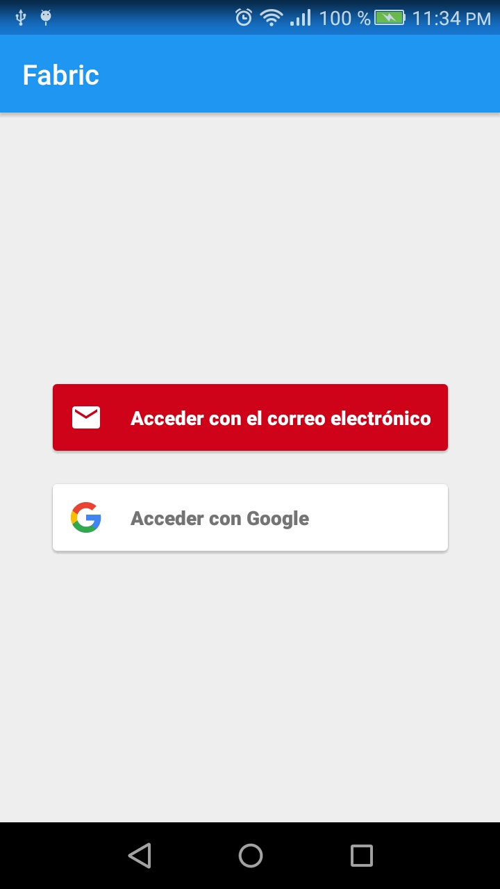
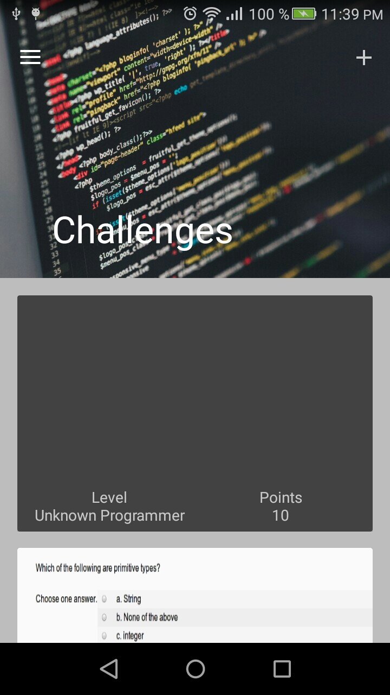
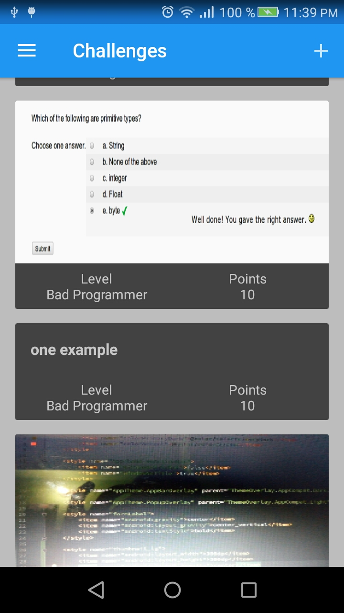
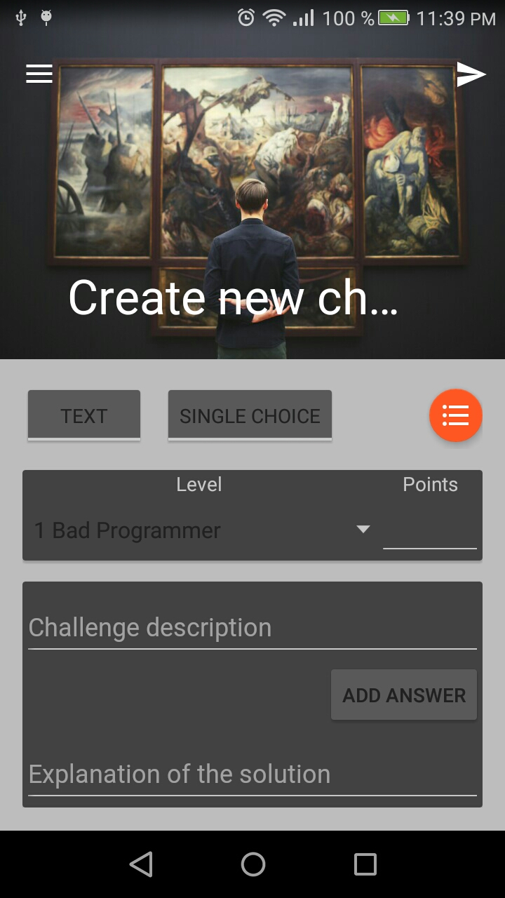
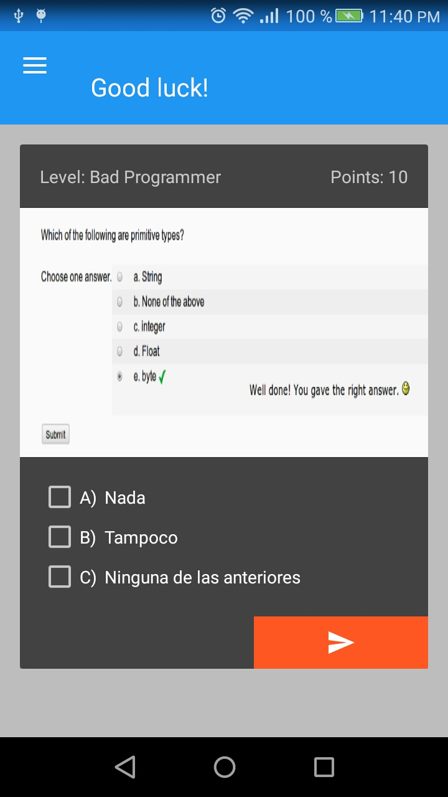
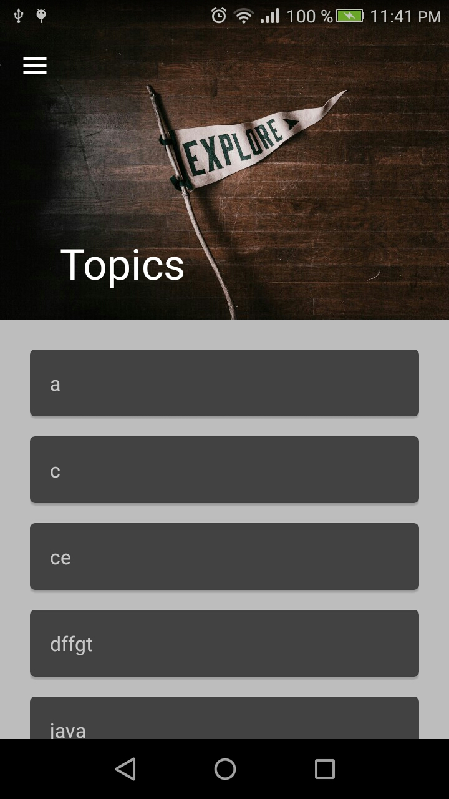

# Fabric

Fabric is a mobile application for android devices. Its objective is to provide developers with an interactive tool to improve their programming skills by completing challenges and sharing with a community of users who share the same objective.

# Using
  - Android SDK
  - Firebase
  - Magic

# New Features!

  - Create and share challenges.
  - Subscribe to topics to get notifications about user interests.

# Some screenshots!

<table>
  <tr>
    <td>   </td>
    <td>  </td>
    <td>  </td>
    <td>  </td>
    </tr>
    <tr>
  <td>  </td>
  <td>  </td>
  <td>  </td>
  <td>  </td>
  </tr>
  <tr> <td>  </td> </tr>
  </table>

**Free Software, Hell Yeah!**
